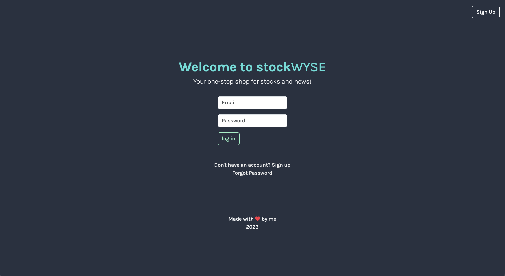

# stockwyse

stockWYSE is a simple Flask application that utilizes, [Bootstrap5](https://getbootstrap.com/), [Firebase](https://firebase.google.com/) and [Finnhub.io](https://finnhub.io/)

It is hosted on GCP through Cloud Run in a Docker container.

Check it out [here](https://stockwyse-3dtk2wionq-uc.a.run.app/)!

